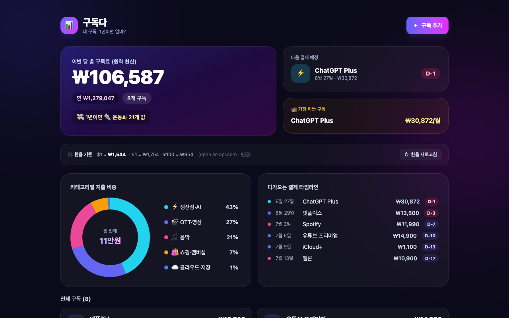

# 구독다 📊

> 넷플릭스·유튜브·멜론·ChatGPT… 흩어진 구독을 한곳에. **"다 합치니 1년에 OO만원?!"** 충격을 주는 구독 관리 대시보드.


## 🔗 라이브 데모

**👉 (배포 후 갱신)**



## ✨ 주요 기능

- 📝 **구독 추가 / 수정 / 삭제** — 서비스명, 금액, 통화, 결제 주기(주·월·연), 다음 결제일, 카테고리, 메모
- 💱 **실시간 환율 환산 (핵심)** — USD·EUR·JPY·GBP 구독을 실시간 환율로 원화 환산해 총액에 합산
  - `open.er-api.com` 우선 호출 → 실패 시 `frankfurter.app` → 둘 다 실패 시 하드코딩 기본 환율로 폴백
  - 받은 환율은 timestamp와 함께 localStorage에 **8시간 캐시**, 오프라인이면 캐시·기본값 사용
  - 화면에 적용 환율(`$1 = ₩1,5xx`)과 출처·갱신 시각 표시, **새로고침 버튼** 제공
- 📊 **대시보드 요약** — 이번 달 총액(원화 환산), 연 환산 금액, 구독 개수, **다음 결제 예정(D-day)**
- 🍩 **시각화** — 카테고리별 지출 비중 도넛 차트(자체 SVG 구현, 호버 인터랙션) + 다가오는 결제 타임라인
- 😮 **재미 요소** — "1년이면 치킨 OO개 값" 위트 환산, 👑 가장 비싼 구독 하이라이트
- 💾 **로컬 저장** — 모든 데이터는 브라우저 localStorage에만 저장, 서버 전송 없음. 재방문 시 복원
- 📱 **모바일 우선 반응형** — 작은 화면에선 하단 FAB·바텀시트 폼

## 🛠 기술 스택

| 구분 | 사용 기술 |
|------|-----------|
| 프레임워크 | React 19 + TypeScript |
| 빌드 | Vite |
| 스타일 | Tailwind CSS v4 |
| 차트 | 자체 구현 SVG 도넛 (라이브러리 없음) |
| 환율 | open.er-api.com / frankfurter.app (무료·키 불필요) |
| 저장 | 브라우저 localStorage |

## 🚀 로컬 실행

```bash
npm install
npm run dev      # http://localhost:5173
```

```bash
npm run build    # 프로덕션 빌드
npm run preview  # 빌드 결과 미리보기 (http://localhost:4173)
```

## 🎨 디자인

딥 인디고(`#0b0a1a`) 배경에 인디고–바이올렛–퓨시아 그라데이션을 더한 모던 핀테크 대시보드 톤. 카드형 레이아웃과 도넛 차트가 시각적 중심입니다.

## 📄 라이선스

MIT
